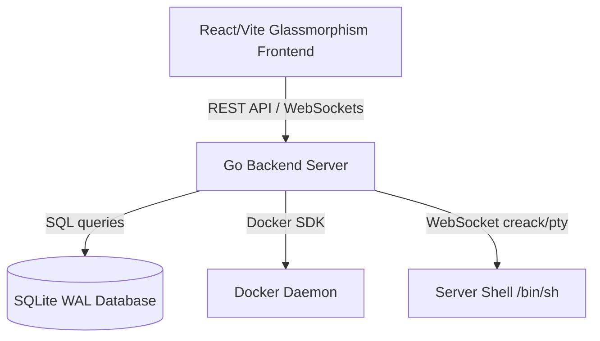

<p align="center">
  
</p>

<h1 align="center">NanoFly</h1>

<p align="center">
  <strong>A premium, self-hosted server control panel and container orchestration platform.</strong>
</p>

<p align="center">
  <a href="#license"></a>
  <a href="https://go.dev"></a>
  <a href="https://react.dev"></a>
  <a href="https://www.sqlite.org"></a>
</p>

---

NanoFly is a professional-grade, lightweight self-hosted dashboard that turns any server (from a resource-constrained **Raspberry Pi** up to a high-end **dedicated VPS**) into an automated service orchestration platform.

Deploy Docker applications, spin up multi-version databases with automatic credential provisioning, inspect container build logs, and manage server resources with a premium glassmorphic interface and a built-in real-time WebSocket PTY terminal.

---

## ✨ Features

- **🚀 Docker App Orchestration:** Support for deploying raw Docker images or GitHub source repositories. Automatic container build pipelines, tags, and start/stop controls.
- **🐘 Managed Multi-Version Databases:** Create PostgreSQL, MySQL, MariaDB, Redis, MongoDB, KeyDB, or ClickHouse instances instantly. Select major engine versions right from the UI, with auto-generated secure credentials.
- **📟 Real WebSocket PTY Terminal:** Fully interactive web terminal powered by `xterm.js` and `creack/pty` stream backends.
- **🔐 Environment Variables & Security:** Complete Env Var panels featuring secure key-value creation, visual value hiding toggles, and copy helpers.
- **🪵 Live Build Logs:** Track Docker builds (`docker build -t ...`) in real-time with expandable log streams.
- **⚡ Lightweight & ARM Compatible:** Optimized to run perfectly on Raspberry Pi or low-end cloud servers, using Go's performance, SQLite's small footprint, and Docker's native daemon.
- **🎨 Glassmorphic Dark UI:** Responsive design prioritizing high-fidelity layouts, custom area charts for server telemetry (CPU, RAM, Temp), and micro-animations.

---

## 🛠️ Architecture



---

## 🚀 Getting Started

### Prerequisites
- [Go 1.23+](https://go.dev/dl/)
- [Node.js 18+](https://nodejs.org/) (for frontend assets compilation)
- [Docker daemon](https://docs.docker.com/get-docker/) running on host system

### Local Development

1. **Clone the repository:**
   ```bash
   git clone https://github.com/your-username/nanofly.git
   cd nanofly
   ```

2. **Run the Go Backend:**
   ```bash
   # Run dependencies resolution
   go mod tidy
   # Run the server
   go run ./cmd/nanofly
   ```
   The backend starts at `http://localhost:8080`.

3. **Run the React Frontend:**
   ```bash
   cd web
   npm install
   npm run dev
   ```
   The Vite dev server will start at `http://localhost:5173`. Open it, and the setup wizard will guide you to create your admin account.

---

## 📦 Building for Production

Compile NanoFly into a single, high-performance binary that serves both the API and the compiled React frontend assets:

```bash
# 1. Build frontend assets
cd web
npm run build
cd ..

# 2. Compile Go binary (cross-compile for Raspberry Pi/Linux ARM64 if needed)
GOOS=linux GOARCH=arm64 go build -ldflags="-s -w" -o nanofly ./cmd/nanofly
```

---

## 📄 License

NanoFly is open-source software licensed under the **GNU Affero General Public License v3.0 (AGPL-3.0)**. 

If you make modifications to the software and run a hosted version of it over a network, you **must** make your modified source code publicly available under the terms of the AGPL-3.0. This guarantees community contribution and keeps NanoFly open for everyone.
