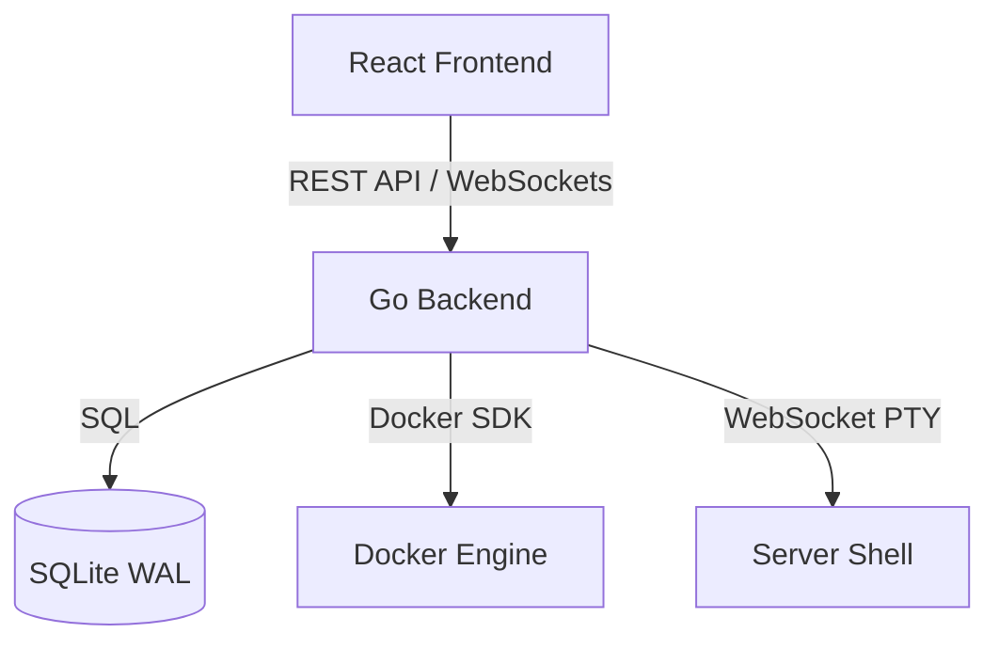

<p align="center">
  
</p>

<h1 align="center">NanoFly</h1>

<p align="center">
  <strong>An open-source & self-hostable alternative to Vercel, Netlify & Heroku.</strong>
</p>

<p align="center">
  Manage your servers, deploy applications & databases on your own hardware.<br/>
  You only need an SSH connection. Works on VPS, bare metal, and Raspberry Pi.
</p>

<p align="center">
  <a href="https://github.com/tamalmaity-dev/nanofly/releases/latest"></a>
  <a href="#license"></a>
  <a href="https://github.com/tamalmaity-dev/nanofly/actions"></a>
  <a href="https://github.com/tamalmaity-dev/nanofly/stargazers"></a>
</p>

---

## 🚀 Installation

To get started, run the following command on your server:

```bash
curl -sSL https://raw.githubusercontent.com/tamalmaity-dev/nanofly/main/install.sh | sudo bash
```

That's it. NanoFly will be installed, configured, and running as a system service.

> **Note**
> Please refer to the docs for more information about the installation. Supports **x86_64** and **ARM64** (Raspberry Pi).

---

## ✨ Features

### 🐳 Docker Application Deployment
Deploy applications from Docker images or directly from GitHub repositories. Automatic container build pipelines with real-time build log streaming, environment variable management, and one-click start/stop controls.

### 🐘 One-Click Database Provisioning
Spin up **PostgreSQL**, **MySQL**, **MariaDB**, **Redis**, **MongoDB**, **KeyDB**, or **ClickHouse** instances instantly. Select major engine versions from the UI with auto-generated secure credentials.

### 📟 Web Terminal
Fully interactive web-based terminal powered by `xterm.js` and `creack/pty`. SSH into your server directly from the browser — no external tools needed.

### 📊 Real-Time Server Monitoring
Live dashboard with CPU usage, memory consumption, temperature readings, and disk metrics. Beautiful area charts with smooth animations for server telemetry.

### 🔐 Security First
- JWT-based authentication with secure session management
- Auto-generated cryptographic secrets during installation
- Environment variable panels with visibility toggles and copy helpers
- AGPL-3.0 licensed — your data stays on your server

### 🪵 Live Build Logs
Track Docker builds in real-time with expandable, streaming log output. Monitor every step of your application's build process as it happens.

### 📦 Project Organization
Group your applications and databases into projects for clean organization. Full CRUD management with intuitive navigation.

### ⚡ Lightweight & ARM Compatible
Optimized to run on a **Raspberry Pi** or low-end cloud servers. Single binary, SQLite database, minimal resource usage. No Java, no heavy runtimes.

### 🔄 Self-Updating
Check for updates and apply them directly from the dashboard. The panel automatically rebuilds and restarts itself with zero manual intervention.

### 🎨 Premium Dark UI
Modern glassmorphic dark interface with smooth micro-animations, responsive layouts, and a design that feels premium — not like a typical admin panel.

---

## 🏗️ Architecture



**Tech Stack:**
- **Backend:** Go with Chi router — single compiled binary
- **Frontend:** React 18 + Vite — pre-built and served by the Go binary
- **Database:** SQLite in WAL mode — zero configuration
- **Containers:** Docker Engine SDK — direct API integration

---

## 🤝 Contributing

We welcome contributions! Feel free to open issues, submit pull requests, or start discussions.

---

## 📄 License

NanoFly is open-source software licensed under the **[GNU Affero General Public License v3.0 (AGPL-3.0)](LICENSE)**.

If you deploy a modified version of NanoFly over a network, you must make your source code available under the same license. This keeps NanoFly open for everyone.
